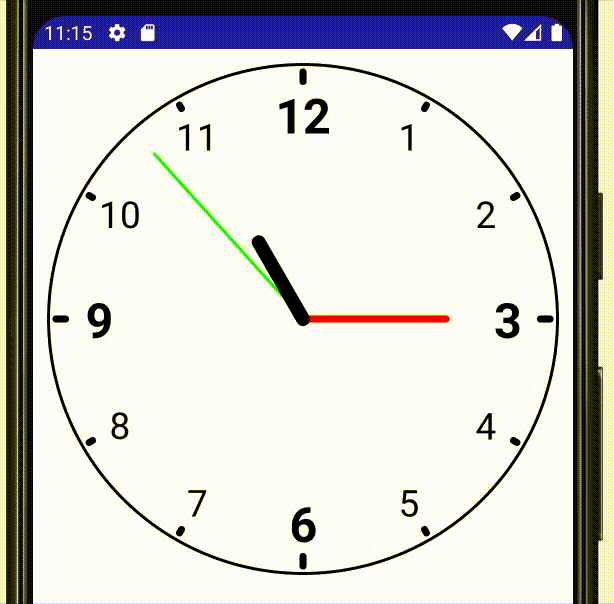

# Compose Clock

A Clock made using Jetpack compose library

## Topics

 - [State Flow and Shared Flow](https://developer.android.com/kotlin/flow/stateflow-and-sharedflow)
 - [Coroutines and ModelView Scope](https://developer.android.com/topic/libraries/architecture/coroutines)
 - [Mutable Shared Flows as an Hot Stream](https://medium.com/swlh/introduction-to-flow-channel-and-shared-stateflow-e1c28c5bc755#:~:text=MutableSharedFlow%20%2F%20MutableStateFlow&text=As%20you%20see%2C%20the%20main,and%20emits%20nothing%20by%20default.) very similar to the stream concept used in Flutter 
